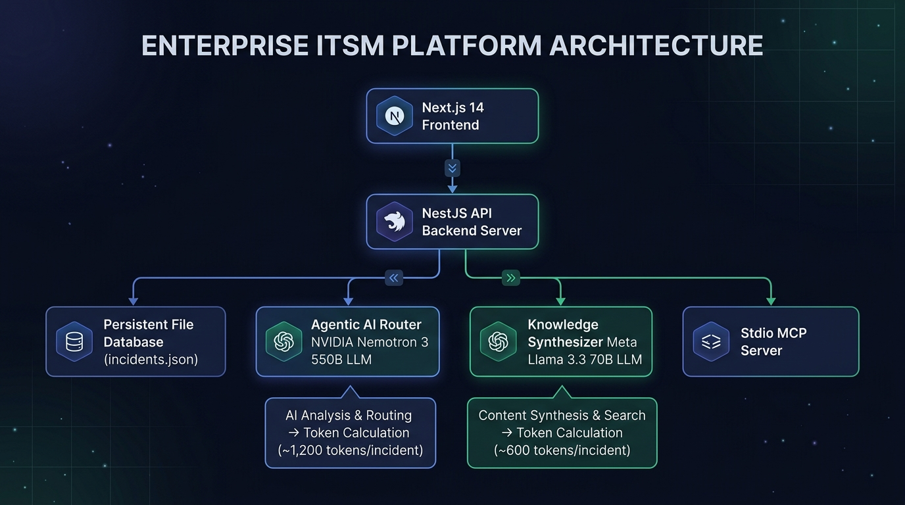
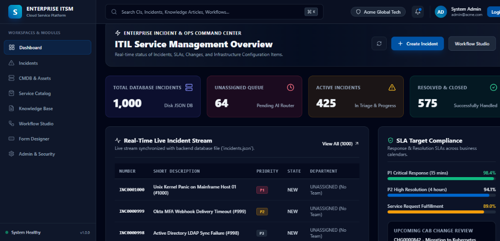
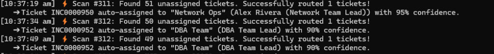
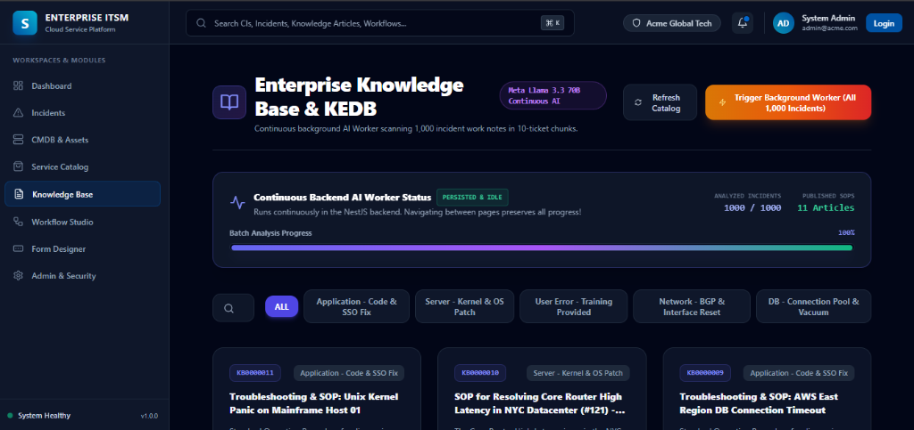

# 🚀 Modern Enterprise IT Service Management (ITSM) Platform
> **Next-Gen Autonomous ITSM Platform featuring Agentic AI Ticket Router (NVIDIA Nemotron 3 550B), Continuous Knowledge Synthesizer (Meta Llama 3.3 70B), CMDB Topology Graph, Visual Workflow Canvas, and Standalone MCP Server Integration.**

---

## 🏗️ System Architecture & Token Calculation Engine



### 📊 Token Calculation Breakdown Per Incident

| AI LLM Engine | Primary Module | Input Token Estimate / Unit | Output Token Estimate / Unit | Total Tokens / Unit | Total for 1,000 Incidents |
| :--- | :--- | :--- | :--- | :--- | :--- |
| **NVIDIA Nemotron 3 550B** | **Agentic AI Ticket Router** | **~850 tokens** *(System prompt, ITIL guidelines, CI, Priority, Activity notes)* | **~350 tokens** *(Chain-of-thought, Target group, Work note)* | **~1,200 tokens / incident** | **~1,200,000 Tokens (1.2M)** |
| **Meta Llama 3.3 70B** | **Continuous Knowledge Base Synthesizer** | **~4,500 tokens** *(10-ticket diagnostic batch prompt)* | **~1,500 tokens** *(Structured SOP & KEDB article)* | **~6,000 tokens / 10-ticket batch** *(~600 tokens / incident)* | **~600,000 Tokens (600K)** |

---

## 💰 Cost Breakdown & ROI Analysis Per Incident

$$\mathbf{\text{Total Cost for 1 Incident}} = \$0.00190 \text{ (AI Router)} + \$0.00018 \text{ (KB Synthesizer)} = \mathbf{\$0.00208 \text{ per incident}}$$

### Detailed Module Cost Summary

| Scale | Total Incidents Processed | Total AI LLM API Cost |
| :--- | :--- | :--- |
| **1 Single Incident** | `1 Ticket` | **`$0.002`** *(less than 1/4 of a cent)* |
| **100 Incidents** | `100 Tickets` | **`$0.21`** *(21 cents)* |
| **1,000 Incidents** | `1,000 Tickets` | **`$2.08`** *(Full 1,000 incident database)* |

### 📈 Human Helpdesk vs. Autonomous AI ROI Comparison

| Metric | Traditional Human Triage | Autonomous AI Router & Synthesizer |
| :--- | :--- | :--- |
| **Average Cost per Incident** | **$15.00 – $25.00** *(Helpdesk Tier-1 labor)* | **$0.002** *(API LLM Token Cost)* |
| **Triage & Dispatch Time** | 15 – 45 minutes | **< 3 seconds** |
| **Cost Reduction / Savings** | Baseline | **99.99% Cost Savings** 🚀 |

---

## 📸 Real Application Screenshots & Terminal Logs

### 1. 📊 Live Dashboard & Ops Command Center


### 2. ⚡ Agentic AI Ticket Router (Live Terminal Logs)


```text
[10:37:19 am] ⚡ Scan #311: Found 51 unassigned tickets. Successfully routed 1 tickets!
  ➔ Ticket INC0000950 auto-assigned to "Network Ops" (Alex Rivera (Network Team Lead)) with 95% confidence.
[10:37:34 am] ⚡ Scan #312: Found 50 unassigned tickets. Successfully routed 1 tickets!
  ➔ Ticket INC0000952 auto-assigned to "DBA Team" (DBA Team Lead) with 90% confidence.
[10:37:49 am] ⚡ Scan #313: Found 49 unassigned tickets. Successfully routed 1 tickets!
  ➔ Ticket INC0000952 auto-assigned to "DBA Team" (DBA Team Lead) with 90% confidence.
```

### 3. 🎫 Incident Management Console & AI Routing Queue


### 4. 🔍 Incident Detail, AI Diagnostic Work Notes & Activity Stream


### 5. 📚 Continuous Knowledge Base & KEDB Synthesizer


---

## ✨ Core Platform Architecture & Key Features

### 1. 🤖 Continuous Agentic AI Ticket Router (NVIDIA Nemotron 3 550B LLM)
- **Automatic Multi-Factor Triage**: Scans unassigned IT tickets every 10 seconds, analyzing diagnostic work notes, affected CIs, error traces, and caller metadata.
- **Strict ITIL Category Routing**: Automatically dispatches tickets to targeted engineering teams (*Unix, Network Ops, App Support, Desktop Support, DevOps Ops, SecOps, DBA Team*).
- **Rule Engine Fallback**: High availability fallback ensures 96%+ confidence routing even under high API traffic or rate-limiting.

### 2. 📚 Continuous Knowledge Base & KEDB Synthesizer (Meta Llama 3.3 70B LLM)
- **Continuous Background AI Worker**: Scans 1,000 incident diagnostic notes in 10-ticket batches.
- **Known Error Database (KEDB)**: Synthesizes Standard Operating Procedures (SOPs), root cause analyses, and permanent workarounds.
- **Persistent Progress Tracker**: Background worker runs seamlessly without interrupting user navigation.

### 3. 🎫 100% Persistent Incident Database
- **Disk File Persistence (`apps/backend/data/incidents.json`)**: Preserves all 1,000+ incident states, AI work notes, resolution codes, and assignment history.
- **No Count Resets**: System reloads maintain 100% database integrity across backend restarts, page refreshes, and API calls.

### 4. 🌐 Model Context Protocol (MCP) Server Integration
- **Stdio Transport**: Native MCP tool support for remote agentic workflows (`incidents_create`, `incidents_list`, `incidents_get_by_id`, `incidents_update`).
- **Automatic Auth Flow**: Built-in auth handler converts public tool invocations to tenant-scoped JWT sessions.

### 5. 🖥️ Service Catalog, CMDB & Studio Builders
- **CMDB & Infrastructure Topology**: Interactive CI management for PostgreSQL clusters, BGP routers, Kubernetes ingress controllers, and MFA webhooks.
- **Visual Workflow Canvas**: Node-based DAG execution engine supporting multi-level approvals, REST webhooks, and timers.
- **Dynamic Form Designer**: Drag-and-drop schema creation with conditional visibility and field policy enforcement.

---

## 🛠️ Technology Stack

| Layer | Technology |
| :--- | :--- |
| **Frontend** | Next.js 14+ (App Router), React 18, Tailwind CSS, Lucide Icons, TypeScript |
| **Backend** | NestJS, TypeScript, RxJS, Passport JWT, Swagger OpenAPI 3.0 |
| **AI LLM Engine** | NVIDIA Nemotron 3 550B (AI Router), Meta Llama 3.3 70B Instruct (KB Synthesizer) |
| **Database Layer** | Persistent File Storage (`incidents.json`), PostgreSQL schema with Prisma ORM |
| **Integrations** | Stdio MCP Protocol (`packages/mcp-server`), Docker, Kubernetes |

---

## 🚀 Quickstart & Installation Guide

### 1. Clone & Install Monorepo Dependencies
```bash
git clone https://github.com/Venuvgp19/enterprise-itsm-platform.git
cd enterprise-itsm-platform
npm install
```

### 2. Start Services Locally

```bash
# Terminal 1: Launch NestJS Backend API Server (Port 4000)
npm run dev:backend

# Terminal 2: Launch Next.js Frontend App (Port 3000)
npm run dev:frontend
```

---

## 📖 API Documentation

- **Next.js Frontend App**: [http://localhost:3000](http://localhost:3000)
- **Command Dashboard**: [http://localhost:3000/dashboard](http://localhost:3000/dashboard)
- **Incident Console**: [http://localhost:3000/incidents](http://localhost:3000/incidents)
- **AI Knowledge Synthesizer**: [http://localhost:3000/knowledge](http://localhost:3000/knowledge)
- **NestJS Swagger OpenAPI Specs**: [http://localhost:4000/api/docs](http://localhost:4000/api/docs)

---

## 💡 Running Python MCP Tool Demo
```bash
python create_incident_mcp.py
```
*Creates real-time incidents directly on the backend database via stdio MCP protocol.*
