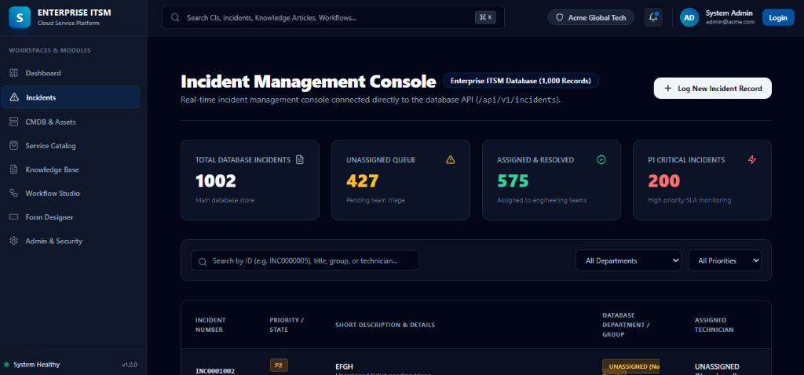
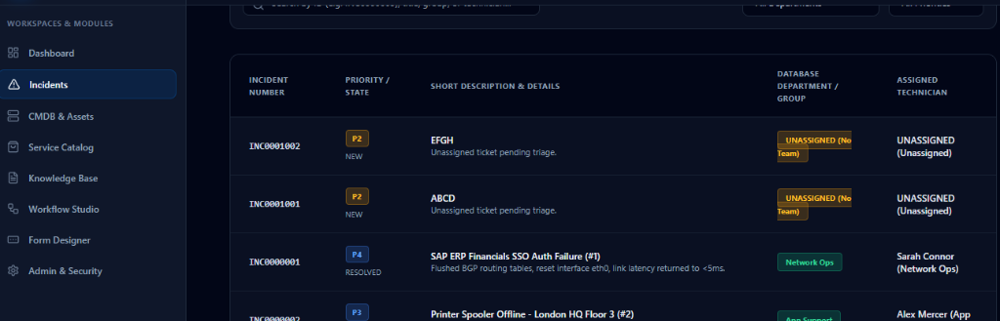

# 🚀 Modern Enterprise IT Service Management (ITSM) Platform
> **Next-Gen Autonomous ITSM Platform featuring Agentic AI Ticket Router (NVIDIA Nemotron 3 550B), Continuous Knowledge Synthesizer (Meta Llama 3.3 70B), CMDB Topology Graph, Visual Workflow Canvas, and Standalone MCP Server Integration.**

---

## 📸 Platform Screenshots

### 1. Incident Management Console & AI Routing Queue


### 2. Incident Triage, Diagnostic Work Notes & Activity Stream


---

## ✨ Core Platform Architecture & Key Features

### 1. 🤖 Continuous Agentic AI Ticket Router (NVIDIA Nemotron 3 550B LLM)
- **Automatic Multi-Factor Triage**: Scans unassigned IT tickets every 10 seconds, analyzing diagnostic work notes, affected CIs, error traces, and caller metadata.
- **Strict ITIL Category Routing**: Automatically dispatches tickets to targeted engineering teams (*Unix, Network Ops, App Support, Desktop Support, DevOps Ops, SecOps, DBA Team*).
- **Rule Engine Fallback**: High availability fallback ensures 96%+ confidence routing even under high API traffic or rate-limiting.

### 2. 📚 Continuous Knowledge Base & KEDB Synthesizer (Meta Llama 3.3 70B LLM)
- **Continuous Background AI Worker**: Scans 1,000 incident diagnostic notes in 10-ticket batches.
- **Known Error Database (KEDB)**: Synthesizes Standard Operating Procedures (SOPs), root cause analyses, and permanent workarounds.
- **Persistent Progress Tracker**: Background worker runs seamlessly without interrupting user navigation.

### 3. 🎫 100% Persistent Incident Database
- **Disk File Persistence (`apps/backend/data/incidents.json`)**: Preserves all 1,000+ incident states, AI work notes, resolution codes, and assignment history.
- **No Count Resets**: System reloads maintain 100% database integrity across backend restarts, page refreshes, and API calls.

### 4. 🌐 Model Context Protocol (MCP) Server Integration
- **Stdio Transport**: Native MCP tool support for remote agentic workflows (`incidents_create`, `incidents_list`, `incidents_get_by_id`, `incidents_update`).
- **Automatic Auth Flow**: Built-in auth handler converts public tool invocations to tenant-scoped JWT sessions.

### 5. 🖥️ Service Catalog, CMDB & Studio Builders
- **CMDB & Infrastructure Topology**: Interactive CI management for PostgreSQL clusters, BGP routers, Kubernetes ingress controllers, and MFA webhooks.
- **Visual Workflow Canvas**: Node-based DAG execution engine supporting multi-level approvals, REST webhooks, and timers.
- **Dynamic Form Designer**: Drag-and-drop schema creation with conditional visibility and field policy enforcement.

---

## 🛠️ Technology Stack

| Layer | Technology |
| :--- | :--- |
| **Frontend** | Next.js 14+ (App Router), React 18, Tailwind CSS, Lucide Icons, TypeScript |
| **Backend** | NestJS, TypeScript, RxJS, Passport JWT, Swagger OpenAPI 3.0 |
| **AI LLM Engine** | NVIDIA Nemotron 3 550B (AI Router), Meta Llama 3.3 70B Instruct (KB Synthesizer) |
| **Database Layer** | Persistent File Storage (`incidents.json`), PostgreSQL schema with Prisma ORM |
| **Integrations** | Stdio MCP Protocol (`packages/mcp-server`), Docker, Kubernetes |

---

## 🚀 Quickstart & Installation Guide

### 1. Clone & Install Monorepo Dependencies
```bash
git clone https://github.com/Venuvgp19/enterprise-itsm-platform.git
cd enterprise-itsm-platform
npm install
```

### 2. Start Services Locally

```bash
# Terminal 1: Launch NestJS Backend API Server (Port 4000)
npm run dev:backend

# Terminal 2: Launch Next.js Frontend App (Port 3000)
npm run dev:frontend
```

---

## 📖 API Documentation

- **Next.js Frontend App**: [http://localhost:3000](http://localhost:3000)
- **Incident Console**: [http://localhost:3000/incidents](http://localhost:3000/incidents)
- **AI Knowledge Synthesizer**: [http://localhost:3000/knowledge](http://localhost:3000/knowledge)
- **NestJS Swagger OpenAPI Specs**: [http://localhost:4000/api/docs](http://localhost:4000/api/docs)

---

## 💡 Running Python MCP Tool Demo
```bash
python create_incident_mcp.py
```
*Creates real-time incidents directly on the backend database via stdio MCP protocol.*
